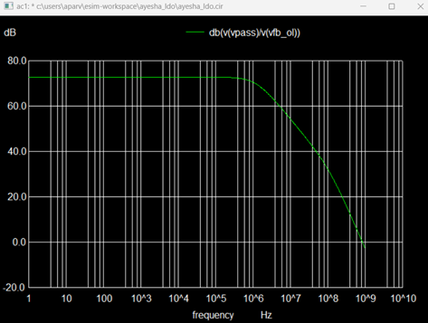

# Low Dropout Regulator Design for Efficient Power Management in Battery-Powered Systems

This design presents a dual-mode LDO for battery-powered systems, implemented using SKY130 PDK with the open-source tool eSim. The dual-mode LDO addresses requirements for blocks needing programmable outputs, 1.2V (low-power core logic) and 2.4V (IO interface blocks), providing flexibility in delivering optimized voltage for different functional requirements within the SoC. This adaptability allows for efficient power distribution, minimizes noise in sensitive blocks, and supports stable operation across varying supplies.

---

## Block Diagram of Proposed LDO

Below is a simplified block diagram of the LDO circuit, showing the key components:

  

---

## LDO Design Performance Parameters

| **Parameter**         | **Description**                                           | **Design I** | **Design II** | **Unit** | **Condition**                                             |
|-----------------------|-----------------------------------------------------------|--------------|---------------|----------|-----------------------------------------------------------|
| **Technology**        | Process                                                   | 0.18 µm CMOS | 0.18 µm CMOS  | -        | -                                                         |
| **Output Voltage**    | Regulated Output voltage                                   | 2.4V         | 1.5V          | V        | -                                                         |
| **R_FB1**             | Feedback resistor 1                                       | 150kΩ        | 150kΩ         | Ω        | -                                                         |
| **R_FB2**             | Feedback resistor 2                                       | 150kΩ        | 600kΩ         | Ω        | -                                                         |
| **C_L**               | Load capacitance                                          | 10pF         | 10pF          | pF       | -                                                         |
| **Line Reg.**         | Line regulation (voltage change per unit supply voltage)  | 3.311        | 3.365         | mV/V     | VDD=3.3V, T=27°C                                          |
| **Error Tolerance**   | Tolerance in output voltage variation                     | ±0.75%       | ±0.8%         | %        | Over supply voltage variations                            |
| **VDD Min**           | Minimum supply voltage                                    | 2.5V         | 2.8V          | V        | For regulated output under given error limit              |
| **VDD Max**           | Maximum supply voltage                                    | 6.2V         | 6.7541V       | V        | For regulated output under given error limit              |
| **VDO**               | Dropout Voltage (difference between Vdd and Vout)         | 0.9V         | 1.8V          | V        | @Vdd=3.3V                                                |
| **PSRR @100kHz**      | Power Supply Rejection Ratio at specified frequency       | 50           | 60            | dB       | @ 100 kHz                                                 |
| **PSRR @0Hz**         | Power Supply Rejection Ratio at DC                        | 50           | 60            | dB       | -                                                         |

---

## LDO Schematic

The following schematic illustrates the dual-mode LDO circuit, supporting both 1.5V and 2.4V supply configurations.

  

---

## Simulation Results (For Vreg = 1.5V)

### Line Regulation

  

### Transient Line Regulation

  

### Operating Point Analysis

  

### PSRR

  

---

## Simulation Results (For Vreg = 2.4V)

### Line Regulation

  

### Transient Line Regulation

  

### Operating Point Analysis

  

---

## Error Amplifier

  

---

## References

1. Jung Sik Kim, Khurram Javed, and Jeongjin Roh, “Design of a low-power and area-efficient LDO regulator using a negative-R-assisted technique,” IEEE Trans. Circuits Syst. II, vol. 70, no. 10, pp. 3892–3896, Oct 2023.
2. Javed S Gaggatur et al., “A 0.009mm², 0-230mA Wide-range Load Current Output Capacitor-less Low Dropout Regulator for High Bandwidth Memory parallel IOs,” in 2022 35th International Conference on VLSI Design (VLSID), 2022, pp. 6–10.
3. M. Reza, N. Alam, and S. J. Gaggatur, "A 0-24mA, 1.2V/1.8V Dual Mode Low Dropout Regulator Design for Efficient Power Management in Battery-Powered Systems," 2024 28th International Symposium on VLSI Design and Test (VDAT), Vellore, India, 2024, pp. 1-6, doi: 10.1109/VDAT63601.2024.10705731.

---

## Acknowledgments

- Kunal Ghosh, Co-founder, VSD Corp. Pvt. Ltd., [kunalpghosh@gmail.com](mailto:kunalpghosh@gmail.com)
- Prof. Naushad Alam, Department of Electronics Engineering, Aligarh Muslim University
- Sumanto Kar, eSim Team, FOSSEE
- FOSSEE, [https://fossee.in/](https://fossee.in/)
- Spoken Tutorial, [https://spoken-tutorial.org/](https://spoken-tutorial.org/)
- VLSI System Design, [https://www.vlsisystemdesign.com/](https://www.vlsisystemdesign.com/)

---

## Author

**Ayesha Parveen**  
B.Tech Electronics Engineering,  
Zakir Husain College of Engineering and Technology (ZHCET),  
Aligarh Muslim University (AMU), Aligarh.
