# Low Dropout Regulator Design for Efficient Power Management in Battery-Powered Systems

This design presents a dual-mode LDO for battery-powered systems, implemented using SKY130 PDK with the open-source tool eSim. The dual-mode LDO addresses requirements for blocks needing programmable outputs, 1.2V (low-power core logic) and 2.4V (IO interface blocks), providing flexibility in delivering optimized voltage for different functional requirements within the SoC. This adaptability allows for efficient power distribution, minimizes noise in sensitive blocks, and supports stable operation across varying supplies.

---

## Block Diagram of Proposed LDO

Below is a simplified block diagram of the LDO circuit, showing the key components:

  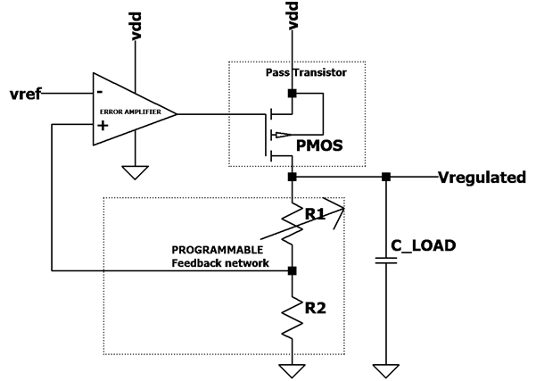

### Explanation:

Error Amplifier: The central component that manages regulation by comparing the feedback voltage with a reference voltage and adjusting the output to maintain stability.
Feedback Network (R_FB1 and R_FB2): These resistors set the output voltage by dividing it back to the error amplifier, ensuring that the output stays regulated at the desired level.
Pass Transistor: Controls the output current and is driven by the error amplifier to stabilize the output voltage.
Load Capacitor (C_L): Provides stability and helps filter noise, critical for ensuring a clean output voltage.
---

## LDO Design Performance Parameters

| **Parameter**         | **Description**                                           | **Design I** | **Design II** | **Unit** | **Condition**                                             |
|-----------------------|-----------------------------------------------------------|--------------|---------------|----------|-----------------------------------------------------------|
| **Technology**        | Process                                                   | 0.18 µm CMOS | 0.18 µm CMOS  | -        | -                                                         |
| **Output Voltage**    | Regulated Output voltage                                   | 2.4V         | 1.5V          | V        | -                                                         |
| **R_FB1**             | Feedback resistor 1                                       | 150kΩ        | 150kΩ         | Ω        | -                                                         |
| **R_FB2**             | Feedback resistor 2                                       | 150kΩ        | 600kΩ         | Ω        | -                                                         |
| **C_L**               | Load capacitance                                          | 10pF         | 10pF          | pF       | -                                                         |
| **Line Reg.**         | Line regulation (voltage change per unit supply voltage)  | 3.311        | 3.365         | mV/V     | VDD=3.3V, T=27°C                                          |
| **Error Tolerance**   | Tolerance in output voltage variation                     | ±0.75%       | ±0.8%         | %        | Over supply voltage variations                            |
| **VDD Min**           | Minimum supply voltage                                    | 2.5V         | 2.8V          | V        | For regulated output under given error limit              |
| **VDD Max**           | Maximum supply voltage                                    | 6.2V         | 6.7541V       | V        | For regulated output under given error limit              |
| **VDO**               | Dropout Voltage (difference between Vdd and Vout)         | 0.9V         | 1.8V          | V        | @Vdd=3.3V                                                |
| **PSRR @100kHz**      | Power Supply Rejection Ratio at specified frequency       | 30           | 32.3            | dB       | @ 100 kHz                                                 |
| **PSRR @0Hz**         | Power Supply Rejection Ratio at DC                        | 45.8           | 40            | dB       | @ DC                                                     |

---

## LDO Schematic

The following schematic illustrates the dual-mode LDO circuit, supporting both 1.5V and 2.4V supply configurations.

  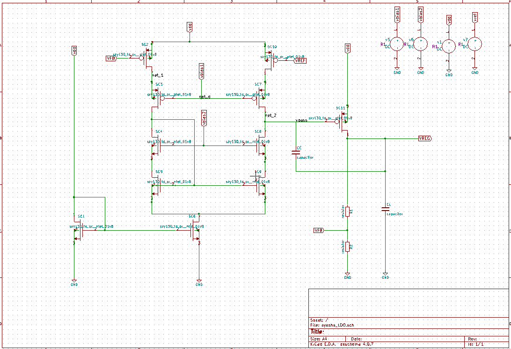

### Explanation:

Switching Resistor Network: Adjusts feedback resistance, enabling quick transitions between different output voltage, by just tuning R2
Compensation Capacitor: Enhances stability in the error amplifier, especially beneficial for transient response under rapid load changes.
Output Stage: The combination of the pass transistor and load capacitor C_L supplies a stable, regulated voltage.
---

## Simulation Results (For Vreg = 1.5V)

### Line Regulation

  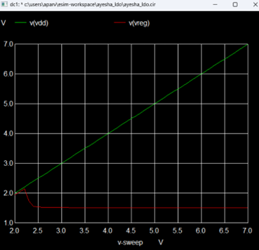

Shows the LDO’s output stability when the input voltage changes, maintaining a regulated output despite variations in supply voltage.

### Transient Line Regulation

  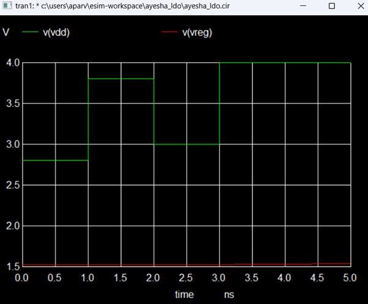

Demonstrates how quickly the LDO responds to sudden shifts in input voltage, essential for applications with dynamic power needs.

### Operating Point Analysis

  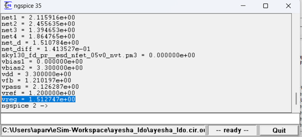

Analyzes the LDO’s operating conditions, verifying stable output voltage across varying conditions.

### PSRR

  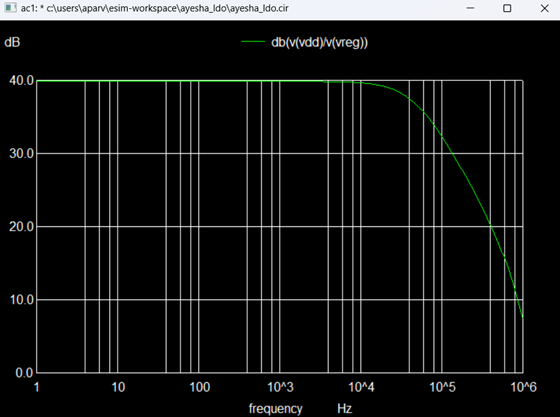

Measures the LDO’s capacity to reject noise from the power supply, a key factor for sensitive analog components that require clean, stable power.
---

## Simulation Results (For Vreg = 2.4V)

### Line Regulation

  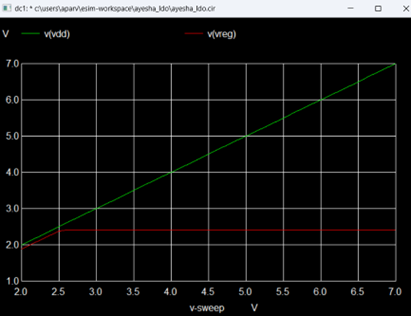

Highlights how the LDO maintains output stability at 2.4V under varying input conditions.

### Regulated Output

  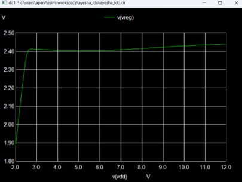

Shows the consistent regulated output at 2.4V, providing insight into performance under higher supply demands.

### Transient Line Regulation

  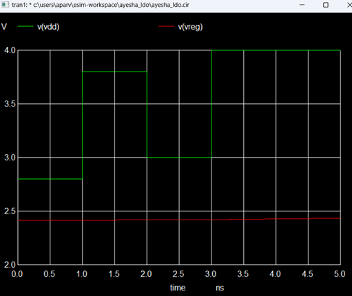

Displays the LDO’s response to fast input changes when operating in the 2.4V mode, crucial for load adaptability.

### Operating Point Analysis

  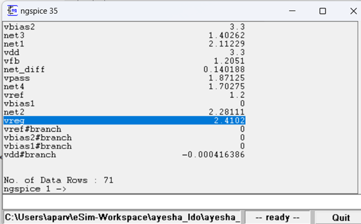

Confirms stability under different conditions, ensuring reliable operation at 2.4V.

---

### Error Amplifier

  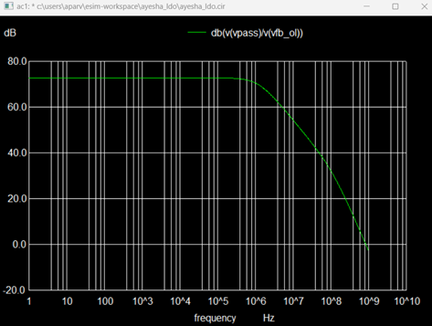

Explanation: This component compares the feedback voltage to the reference, adjusting the pass transistor to maintain a stable output. Its design affects the LDO’s speed and stability, directly impacting line and load regulation.

---

## Steps to run this project
1. Open a new terminal
2. Clone this project using the following command: 
   `git clone https://github.com/aparveen8/lowdropoutregulator.git` 
3. Change directory: 
   `cd eSim_Project_Files/ayesha_LDO/` 
4. Run ngspice: 
   `ngspice ayesha_LDO.cir.out` 
5. To run the project in eSim:
	- Run eSim 
	- Load the project 
	- Open eeSchema to view schematic and click on simulate, make sure to open respective cir file for specific simulations   
 ---

## References

1. Jung Sik Kim, Khurram Javed, and Jeongjin Roh, “Design of a low-power and area-efficient LDO regulator using a negative-R-assisted technique,” IEEE Trans. Circuits Syst. II, vol. 70, no. 10, pp. 3892–3896, Oct 2023.
2. Javed S Gaggatur et al., “A 0.009mm², 0-230mA Wide-range Load Current Output Capacitor-less Low Dropout Regulator for High Bandwidth Memory parallel IOs,” in 2022 35th International Conference on VLSI Design (VLSID), 2022, pp. 6–10.
3. M. Reza, N. Alam, and S. J. Gaggatur, "A 0-24mA, 1.2V/1.8V Dual Mode Low Dropout Regulator Design for Efficient Power Management in Battery-Powered Systems," 2024 28th International Symposium on VLSI Design and Test (VDAT), Vellore, India, 2024, pp. 1-6, doi: 10.1109/VDAT63601.2024.10705731.

---

## Acknowledgments

- Kunal Ghosh, Co-founder, VSD Corp. Pvt. Ltd., [kunalpghosh@gmail.com](mailto:kunalpghosh@gmail.com)
- Prof. Naushad Alam, Department of Electronics Engineering, Aligarh Muslim University
- Sumanto Kar, eSim Team, FOSSEE
- FOSSEE, [https://fossee.in/](https://fossee.in/)
- Spoken Tutorial, [https://spoken-tutorial.org/](https://spoken-tutorial.org/)
- VLSI System Design, [https://www.vlsisystemdesign.com/](https://www.vlsisystemdesign.com/)

---

## Author

**Ayesha Parveen**  
B.Tech Electronics Engineering,  
Zakir Husain College of Engineering and Technology (ZHCET),  
Aligarh Muslim University (AMU), Aligarh.
