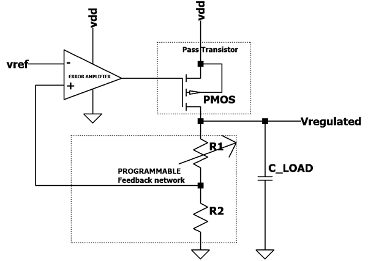
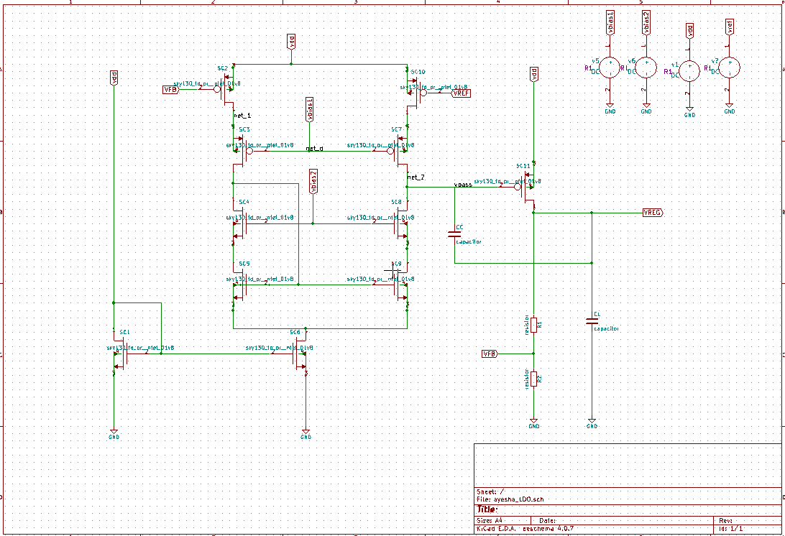
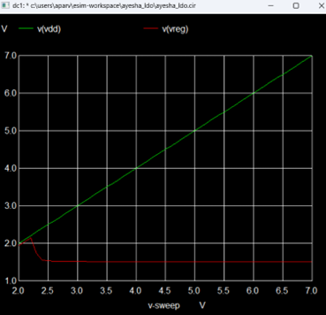
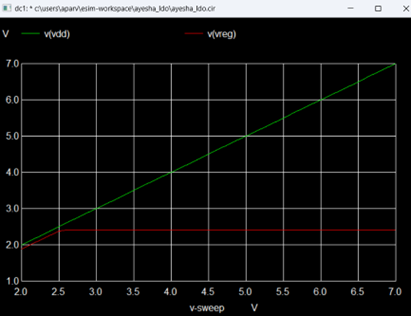
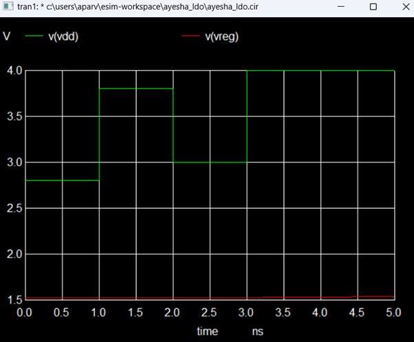
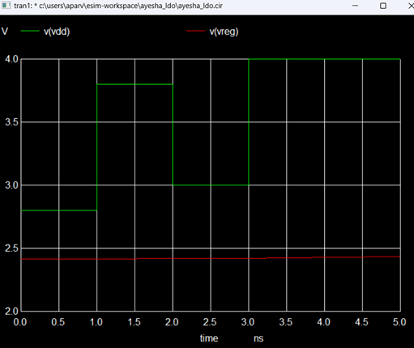

# Low Dropout Regulator Design for Efficient Power Management in Battery-Powered Systems

This design presents a dual-mode LDO for battery-powered systems, implemented using SKY130 PDK with open source tool, esim. This dual-mode LDO addresses the requirements for blocks needing programmable outputs, 1.2V (low-power core logic) and 2.4V (IO interfaces blocks), offering flexibility in delivering optimized voltage for different functional requirements within the SoC. This adaptability allows for efficient power distribution, minimizes noise in sensitive blocks, and supports stable operation across varying supply.

## Table of Contents
- [Block Diagram](#block-diagram)
- [Dual Mode Design Parameters](#dual-mode-design-parameters)
- [Circuit Schematic](#circuit-schematic)
- [Software Used](#software-used)
- [Simulation Results](#simulation-results)
  - [PSRR Analysis](#psrr-analysis)
  - [Load and Line Regulation](#load-and-line-regulation)
- [Netlists](#netlists)
- [Steps to Run NgVeri Model](#steps-to-run-ngveri-model)
- [Steps to Run this Project](#steps-to-run-this-project)
- [References](#references)
- [Acknowledgments](#acknowledgments)
- [Author](#author)

---

## A Glance at block diagram of Proposed LDO
Below is a simplified block diagram of the LDO circuit, showing the key components:

  

---

## LDO Design Perforance Parameters

| **Parameter**         | **Description**                                           | **Design I** | **Design II** | **Unit** | **Condition**                                             |
|----------------------|-----------------------------------------------------------|--------------|---------------|----------|----------------------------------------------------------|
| **Technology**        | Process                                                   | 0.18 µm CMOS | 0.18 µm CMOS  | -        | -                                                        |
| **Output Voltage**    | Regulated Output voltage                                   | 2.4V         | 1.5V          | V        | -                                                        |
| **R_FB1**              | Feedback resistor 1                                       | 150kΩ         | 150kΩ           | Ω        | -                                                        |
| **RFB2**               | Feedback resistor 2                                       | 150kΩ         | 600kΩ          | Ω        | -                                                        |
| **CL**                 | Load capacitance                                          | 10pF         | 10pF          | pF       | -                                                        |
| **Line Reg.**         | Line regulation (voltage change per unit supply voltage) | 3.311        | 3.365           | mV/V       | VDD=3.3V, T=27°C                                          |
| **Error Tolerance**   | Tolerance in output voltage variation                    | ±0.75%        | ±.8%         | %        | Over supply voltage variations           |
| **VDD min**   | minimum supply voltgae                   | 2.5     |    2.8    | V       | For regulated output under given error limit            |
| **VDD max**   | maximum supply voltgae                   |  6.2    |   6.7541     | V       | For regulated output under given error limit           |
| **VDO **    | Drop Out Voltage (difference between Vdd and Vout)      |  0.9         |     1.8    |    |     @Vdd=3.3V                                         |
| **PSRR @100kHz **    | Power Supply Rejection Ratio at specified frequency       | 50           | 60            | dB       | at 100 kHz                                                  |
| **PSRR @0Hz   **    | Power Supply Rejection Ratio at specified frequency       | 50           | 60            | dB       | at DC                                                 |

---

## Circuit Schematic
The following schematic illustrates the dual-mode LDO circuit, supporting both 1.2V and 1.8V supply configurations.

  

---

## Simulation Results (For Vreg=2.4)

### Line Regulation

  

  

### Transient Line Regulation

  

  

  

---

---

# References

# Acknowledgments

- FOSSEE, [https://fossee.in/](https://fossee.in/)
- Kunal Ghosh, Co-founder, VSD Corp. Pvt. Ltd., [kunalpghosh@gmail.com](mailto:kunalpghosh@gmail.com)
- Sumanto Kar, eSim Team, FOSSEE
- Spoken Tutorial, [https://spoken-tutorial.org/](https://spoken-tutorial.org/)
- VLSI System Design, [https://www.vlsisystemdesign.com/](https://www.vlsisystemdesign.com/)
- 
# Author

**Ayesha Parveen**,  
B.Tech Electronics Engineering,  
Zakir Husain College of Engineering and Technology (ZHCET),  
Aligarh Muslim University (AMU), Aligarh.

